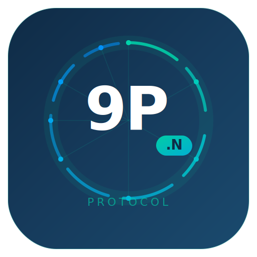

<p align="center">
  
</p>

<h1 align="center">9P2000.N</h1>

<p align="center">
  A modular, capability-negotiated extension framework for the
  <a href="https://en.wikipedia.org/wiki/9P_(protocol)">9P</a> remote resource protocol.
</p>

<p align="center">
  <a href="spec/9P2000.N-protocol.md">Specification</a> &middot;
  <a href="spec/9P2000.N-protocol-format.md">Wire Format</a> &middot;
  <a href="ref/c/">Reference Impl</a> &middot;
  <a href="#spiffe-integration">SPIFFE</a> &middot;
  <a href="assets/9P2000N-presentation-en.html">Slides</a>
</p>

---

## What is 9P2000.N?

[9P](https://plan9.io) is a network protocol from Plan 9 for accessing remote files, devices, and services. Linux ships with a built-in client ([v9fs](https://docs.kernel.org/filesystems/9p.html)), and it is widely used in QEMU/KVM, WSL2, and container runtimes.

The existing variants (9P2000, 9P2000.u, 9P2000.L) each add features as monolithic dialects &mdash; you negotiate one version string and get everything or nothing. **9P2000.N** (Next/Negotiated) changes this with a **composable capability negotiation framework**: implementations pick and choose from independently negotiable extensions across 9 domains, without an all-or-nothing tradeoff.

## Protocol at a Glance

### Design Principles

| Principle | How |
|-----------|-----|
| **Wire format preserved** | `size[4] type[1] tag[2] payload` &mdash; the 7-byte header is unchanged |
| **Composable capabilities** | `Tcaps/Rcaps` replaces monolithic version strings; each feature is independently negotiable |
| **Server push** | Three message types use `tag = P9_NOTAG (0xFFFF)` for unsolicited server-to-client notifications |
| **Compound operations** | `Tcompound` packs N sub-ops into 1 round-trip (inspired by NFS4 COMPOUND) |
| **Graceful fallback** | If the server doesn't support `9P2000.N`, it falls back to `9P2000.L` or lower |
| **Purely additive** | No existing message semantics are modified; new types use previously unused type numbers |

### 9 Extension Domains

| Domain | Capability | Type Range | Description |
|--------|-----------|-----------|-------------|
| Negotiation | *(core)* | 128-129 | `Tcaps/Rcaps` capability framework |
| Security | `security.*` | 130-145 | TLS, auth negotiation, capability tokens, audit, **SPIFFE** |
| Performance | `perf.*` | 156-167 | Compound ops, compression, zero-copy, server-side copy, sparse files |
| Filesystem | `fs.*` | 180-199 | Watch/notify, ACLs, snapshots/clones, first-class xattr |
| Distributed | `dist.*` | 200-213 | Leases/delegations, session resumption, consistency levels, topology |
| Observability | `obs.*` | 220-225 | Distributed tracing, health checks, server stats |
| Resources | `res.*` | 230-235 | Quota management, rate limiting |
| Streaming | `stream.*` | 240-249 | Async operations, streaming read/write |
| Content | `content.*` | 250-253 | Server-side search, content hashing |
| Transport | `transport.*` | 146-155 | CXL memory mapping & coherence, QUIC multistream, RDMA tokens & notification ring |

**51 T/R message pairs** &middot; 102 type slots used &middot; 96 reserved for future growth.

### Capability Negotiation

Unlike prior 9P variants that negotiate a single version string, 9P2000.N uses a two-step approach:

```
Client                                Server
  |                                     |
  |--- Tversion "9P2000.N" msize  ----->|
  |<-- Rversion "9P2000.N" msize  ------|
  |                                     |
  |--- Tcaps [security.tls,            -|    client lists desired capabilities
  |           perf.compound,            |
  |           fs.watch,                 |
  |           dist.lease]              -|
  |                                     |
  |<-- Rcaps [perf.compound,           -|    server returns its supported subset
  |           fs.watch]                -|
  |                                     |
  |   (both sides now know the active   |
  |    capability set)                  |
```

### Server Push

9P has historically been strictly client-initiated request/response. 9P2000.N introduces server-initiated messages using the reserved `P9_NOTAG (0xFFFF)` tag &mdash; no wire format change required:

| Type | Name | Trigger |
|------|------|---------|
| 185 | `Rnotify` | Watched file/directory changed |
| 205 | `Rleasebreak` | Server needs to downgrade/revoke a client's lease |
| 247 | `Rstreamdata` | Streaming read data delivery |

Clients that haven't negotiated the corresponding capability never receive these messages.

### Compound Operations

`Tcompound` packs multiple sub-operations into a single round-trip. The magic fid `0xFFFFFFFE` (`P9N_PREVFID`) refers to the fid returned by the preceding sub-op, enabling chained operations without advance fid knowledge:

```
Old way (9P2000.L): 4 RTTs          New way (9P2000.N): 1 RTT
  Client       Server                 Client          Server
    |--Twalk---->|  RTT1                 |--Tcompound-->|  RTT1
    |<-Rwalk-----|                       |  [Twalk,     |
    |--Tlopen--->|  RTT2                 |   Tlopen,    |
    |<-Rlopen----|                       |   Tread,     |
    |--Tread---->|  RTT3                 |   Tclunk]    |
    |<-Rread-----|                       |<-Rcompound---|
    |--Tclunk--->|  RTT4                 |  [results]   |
    |<-Rclunk----|
```

### Leases and Cache Coherence

`Tlease` grants clients a time-limited caching delegation, modeled after NFS4 delegations:

- **Read lease**: client caches file content; invalidated by server via `Rleasebreak` when another client writes
- **Write lease**: client caches both reads and writes; exclusive access guaranteed
- **Lease break**: server sends `Rleasebreak` (tag=0xFFFF); client flushes dirty data and acknowledges via `Tleaseack`

## SPIFFE Integration

9P2000.N has first-class support for [SPIFFE](https://spiffe.io) workload identity through the `security.spiffe` capability:

| Feature | Message | Description |
|---------|---------|-------------|
| Identity-aware mTLS | `Tstartls_spiffe` | Both sides declare SPIFFE IDs and trust domains before TLS handshake; certs must contain X.509-SVID extension |
| Trust bundle fetch | `Tfetchbundle` | Retrieve X.509 CA chains or JWT JWK Sets for any trust domain (enables federation) |
| SVID verification | `Tspiffeverify` | Client presents X.509 cert chain or JWT-SVID; server verifies and returns status |
| Auth mechanism | `Tauthneg` | `SPIFFE-X.509` and `SPIFFE-JWT` as first-class auth mechanisms |
| JWT-SVID as tokens | `Rcapgrant` | Capability tokens can be JWT-SVIDs with `sub`=SPIFFE ID, `p9n_rights`, `p9n_depth` claims |

```
Client                                  Server
  |                                       |
  |--- Tcaps [security.spiffe, ...] ----->|
  |<-- Rcaps [security.spiffe, ...] ------|
  |                                       |
  |--- Tfetchbundle "example.com" 0 ----->|    fetch X.509 trust bundle
  |<-- Rfetchbundle PEM CA chain ---------|
  |                                       |
  |--- Tstartls_spiffe ------------------>|    exchange SPIFFE IDs
  |<-- Rstartls_spiffe -------------------|
  |        <<< mTLS with X.509-SVIDs >>>  |
  |                                       |
  |--- Tauthneg [SPIFFE-X.509] ---------->|
  |<-- Rauthneg "SPIFFE-X.509" -----------|
  |--- Tattach ... ---------------------->|
  |<-- Rattach ... -----------------------|
```

## Comparison with Existing 9P Variants

| Feature | 9P2000 | 9P2000.u | 9P2000.L | **9P2000.N** |
|---------|--------|----------|----------|------------|
| Message type pairs | 14 | 14 | ~25 | **46** |
| Feature negotiation | single string | single string | single string | **composable capabilities** |
| Server push | no | no | no | **yes (P9_NOTAG)** |
| Encryption | no | no | no | **STARTTLS** |
| Cache coherence | no | no | no | **leases/delegations** |
| Workload identity | no | no | no | **SPIFFE** |
| Compound operations | no | no | no | **Tcompound** |
| Change notifications | no | no | no | **watch/notify** |
| Compression | no | no | no | **lz4/zstd/snappy** |
| Server-side copy | no | no | no | **copy_file_range** |

## Repository Structure

```
spec/
  9P2000.N-protocol.md          Normative protocol specification
  9P2000.N-protocol-format.md   RFC-style wire format (bit-field diagrams)

ref/
  c/                             C reference implementation (36 tests)
    include/9pN.h                  Protocol header (all types, structures, API)
    src/                           buf.c, caps.c, protocol.c, compound.c
    tests/test_9pN.c               Unit tests
    Makefile                       Build system
    README.md                      Build guide and API reference
  go/                            Go reference implementation (34 tests)
    p9n/                           Package: types, buf, caps, codec
    p9n/p9n_test.go                Unit tests
    go.mod                         Module definition
    README.md                      Usage guide
  rust/                          Rust reference implementation (35 tests)
    src/                           types.rs, buf.rs, caps.rs, codec.rs
    Cargo.toml                     Crate manifest (no external deps)
    README.md                      Usage guide

assets/
  9pN-icon.svg                   Project icon
  9pN-favicon.svg                Favicon
  9P2000N-presentation-en.html   Conference slides (English, 17 slides)
  9P2000N-presentation-cn.html   Conference slides (Chinese, 17 slides)
```

## Specification

| Document | Contents |
|----------|----------|
| [`spec/9P2000.N-protocol.md`](spec/9P2000.N-protocol.md) | Normative spec: capability framework, all 46 message types, SPIFFE integration, connection lifecycle |
| [`spec/9P2000.N-protocol-format.md`](spec/9P2000.N-protocol-format.md) | RFC-style companion with bit-field diagrams for every message on the wire |

## Reference Implementation

Two reference implementations demonstrate the exact wire format for all 46 message type pairs:

| Language | Directory | Tests | Build |
|----------|-----------|-------|-------|
| C | [`ref/c/`](ref/c/) | 45 passing | `cd ref/c && make test` |
| Go | [`ref/go/`](ref/go/) | 42 passing | `cd ref/go && go test ./p9n/` |
| Rust | [`ref/rust/`](ref/rust/) | 44 passing | `cd ref/rust && cargo test` |

All three implementations cover: buffer primitives, capability negotiation, marshal/unmarshal round-trips for all P0 message types, SPIFFE integration, and wire format verification. Zero external dependencies across all implementations.

## Presentation

A meetup slide deck is available:

- [English version](assets/9P2000N-presentation-en.html)
- [Chinese version](assets/9P2000N-presentation-cn.html)

Open in any browser &mdash; supports keyboard navigation, touch swipe, and a progress bar.

## Roadmap

### Phase 1 &mdash; Protocol &amp; Reference Implementation *(current)*

- [x] Capability negotiation framework (`Tcaps/Rcaps`)
- [x] Security: TLS, auth negotiation, SPIFFE (3 message pairs)
- [x] Performance: compound operations
- [x] Filesystem: watch/notify with server push
- [x] Distributed: leases/delegations with server push, session resumption
- [x] Full protocol codec for all 46 message types
- [x] C reference implementation with 36 passing tests
- [x] Normative specification + RFC-style wire format document

### Phase 2 &mdash; Transport &amp; Ecosystem

- [ ] TCP / Unix socket / virtio transport integration
- [ ] Compression, server-side copy, sparse files
- [ ] Distributed tracing, health checks, quotas
- [ ] Go and Rust client library implementations

### Phase 3 &mdash; Production

- [ ] Snapshots/clones, streaming I/O, server-side search
- [ ] Cross-domain SPIFFE federation
- [ ] Linux kernel module (v9fs extension)
- [ ] QEMU virtio-9p-next patches

## References

- [9P2000 RFC](https://ericvh.github.io/9p-rfc/rfc9p2000.html)
- [9P2000.u RFC](https://ericvh.github.io/9p-rfc/rfc9p2000.u.html)
- [9P2000.L Specification](https://github.com/ericvh/9p-rfc/blob/master/9p2000.L.xml)
- [Linux v9fs Documentation](https://docs.kernel.org/filesystems/9p.html)
- [SPIFFE Specification](https://spiffe.io/docs/latest/spiffe-about/spiffe-concepts/)
- [diod Protocol Documentation](https://github.com/chaos/diod/blob/master/protocol.md)

## License

This project is licensed under the [MIT License](LICENSE).
